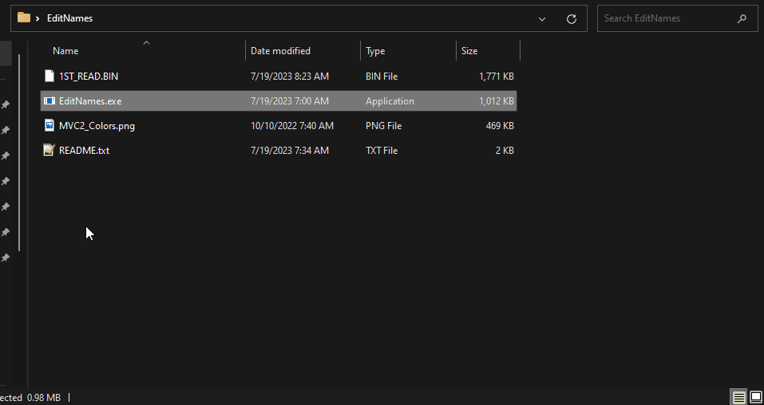

# Marvel Vs Capcom 2 Player Name Edit Tool 


Edits the saved Player Names inside a modded US Dreamcast Version of Marvel vs Capcom 2 that was edited by the MVC2 Modding Page:

 [MVC2 Modding Page](https://www.paxtez.zachd.com)


Edits 1ST_READ.BIN, .CDIs, .GDI, or .BIN files or any other format that keeps the files mostly intact (no .ZIPs).


#### USAGE:

``EditNames.exe                    <- Edits a 1ST_READ.BIN in the same path``

``EditNames.exe "MVC2.CDI"         <- Edit the .CDI file``

``EditNames.exe "1ST_READ.BIN.bak" <- Edits this 1ST_READ``


My C/C++ code is very ugly, I learned this bastard version of it many years ago, and never unlearned it. Beware.


#### DEMO



#### PLAYER NAME DATA FORMAT
In a 1ST_READ.BIN this may be at 0x1BAA80, but it may change, you can edit it by hand with a Hex Editor if you want.


```
1234567890ABCDEF
 NEW CHALLANGER.     // Default name
[ PLAYER NAMES ]     // Search string
  PLAYER NAME 1.     // Names Can be up to 14 characters
          NAME2.     // The first character must be a space
          NAME3.     // The last character must be a null
................     // Names can be skipped
            NM5.     // Name needs to be right justified
            NM6.     // with spaces
     . . .           // Omitted lines for demo, there must be 16 in the game
 PLAYER NAME 16.     //
           WINS.     // Win counter for Default Name
xxxxxxxxxxxxxxxx     // x = Color data, 0xFF Will skip player  [1]
yzzzzzzzzzzzzzzz     // y and z are space offsets, this is a hex int (0xB = 11)
z                    // y is spaces for "WINS" | z is for the 16 names in order
1234567890ABCDEF

[1]: Each byte is for each of the 16 player names: 0x0B - 0x38 [with some gaps]

```
